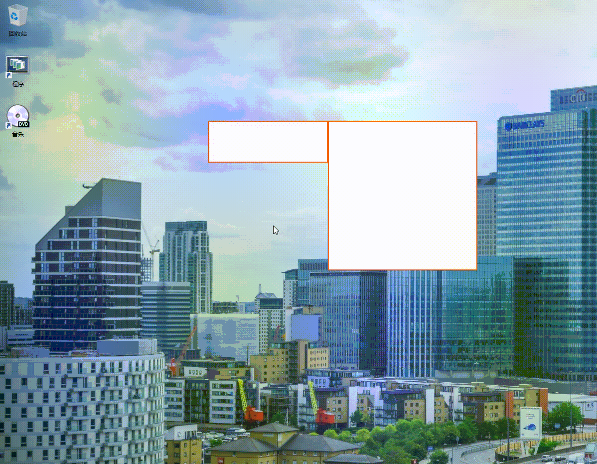

# |简·陋| 多窗体 HTA 模板

本模板很厉害。

本模板用 `showModelessDialog` 根据本地 url 创建对应 hta 的子窗体，再用 `dialogArguments` 使子窗体得到实际位于父窗体的“全局对象”的引用。
本模板应接管父窗体和各个子窗体的拖动，在位置的改变结束时通过“全局对象”实现父窗体和各个子窗体之间主要关于窗体位置的的通信，从而实现窗体吸附、窗体拖拽等功能。

简单的演示：

但是本模板过于高级，导致开发者心力交瘁，心律不齐、心悸、心慌、心肌梗塞、心有余而力不足，甚至连窗体之间的拖动 API 都做好了，就是没有实现连带拖动效果。

如果有人感兴趣，可以尝试接着开发一下。
本模板注释优美格式良好。
